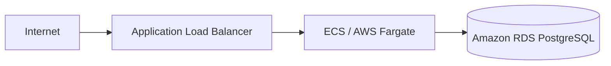
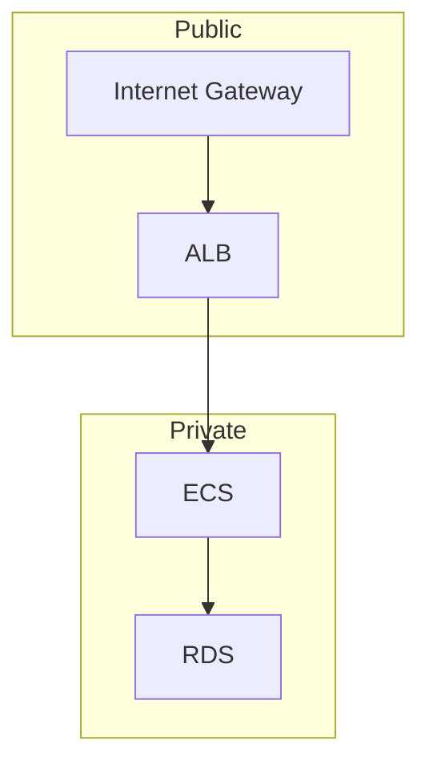

# DevOps Assessment: Terraform + Database Reliability

<p align="center">


</p>

---

## 📖 Overview

This repository demonstrates a production-oriented DevOps project implementing:

* Infrastructure as Code using Terraform
* Modular AWS architecture
* Multi-environment configuration (`dev` & `prod`)
* PostgreSQL with Docker Compose
* Database migrations & seed data
* Query optimization with indexing
* Automated backup & restore
* CI validation using GitHub Actions

> **Note**
>
> This project is designed for **Terraform validation and planning only**. AWS deployment is not required. All Terraform code is production-oriented and intended to pass:
>
> * `terraform fmt`
> * `terraform init`
> * `terraform validate`
> * `terraform plan`

---

# 📑 Table of Contents

* [Project Structure](#-project-structure)
* [Architecture](#-architecture)
* [Terraform Infrastructure](#-terraform-infrastructure)
* [Environment Configuration](#-environment-configuration)
* [Running Terraform](#-running-terraform)
* [GitHub Actions](#-github-actions)
* [Local PostgreSQL](#-local-postgresql)
* [Query Optimization](#-query-optimization)
* [Backup & Restore](#-backup--restore)
* [Cleanup](#-cleanup)
* [Submission Checklist](#-submission-checklist)

---

# 📂 Project Structure

```text
.
├── infra
│   ├── modules
│   │   ├── network
│   │   ├── ecs
│   │   └── rds
│   │
│   └── envs
│       ├── dev
│       └── prod
│
├── db
│   ├── migrations
│   ├── indexes
│   └── seeds
│
├── scripts
│   ├── backup.sh
│   └── restore.sh
│
├── .github
│   └── workflows
│       └── terraform.yml
│
├── docker-compose.yml
└── README.md
```

---

# 🏗️ Architecture

## Infrastructure Flow



## Network Layout



---

# ☁️ Terraform Infrastructure

<details>
<summary><strong>Click to view infrastructure resources</strong></summary>

### Networking

* VPC
* Public Subnets
* Private Subnets
* Internet Gateway
* NAT Gateway
* Route Tables

### Security

* ALB Security Group
* ECS Security Group
* RDS Security Group

### Compute

* ECS Cluster
* ECS Task Definition
* ECS Service

### Load Balancing

* Application Load Balancer
* Target Group
* Listener

### Database

* PostgreSQL RDS
* DB Subnet Group

</details>

---

# 🌍 Environment Configuration

| Setting             | Dev          | Prod         |
| ------------------- | ------------ | ------------ |
| ECS CPU             | 256          | 512          |
| ECS Memory          | 512 MB       | 1024 MB      |
| Desired Tasks       | 1            | 2            |
| Database Instance   | db.t4g.micro | db.t4g.small |
| Storage             | 20 GB        | 50 GB        |
| Backup Retention    | Short        | Long         |
| Deletion Protection | Disabled     | Enabled      |

Each environment has its own:

* backend configuration
* variables
* tfvars
* outputs
* resource sizing

---

# 🚀 Running Terraform

## Development

```bash
cd infra/envs/dev

terraform fmt -recursive ../../..
terraform init
terraform validate
terraform plan -refresh=false -var-file=dev.tfvars
```

## Production

```bash
cd infra/envs/prod

terraform init
terraform validate
terraform plan -refresh=false -var-file=prod.tfvars
```

### Export Terraform Plan as JSON

```bash
terraform plan \
-refresh=false \
-var-file=prod.tfvars \
-out=tfplan

terraform show -json tfplan > tfplan.json
```

`tfplan.json` contains the full execution plan and planned infrastructure changes.

---

# ⚙️ GitHub Actions

Workflow location:

```text
.github/workflows/terraform.yml
```

The workflow automatically performs:

* ✅ Terraform Format Check
* ✅ Terraform Init
* ✅ Terraform Validate
* ✅ Terraform Plan
* ✅ Upload Plan Artifact

---

# 🐘 Local PostgreSQL

Start PostgreSQL:

```bash
docker compose up -d
```

Database Configuration

| Property | Value          |
| -------- | -------------- |
| Database | insurance_db   |
| User     | insurance_user |
| Password | insurance_pass |
| Port     | 5432           |

Docker automatically executes:

* `001_create_tables.sql`
* `002_indexes.sql`
* `001_seed_data.sql`

---

## Verify Seed Data

```bash
docker compose exec postgres psql -U insurance_user -d insurance_db -c "SELECT COUNT(*) FROM hotel_bookings;"

docker compose exec postgres psql -U insurance_user -d insurance_db -c "SELECT COUNT(*) FROM booking_events;"
```

Example

```text
hotel_bookings : 150

booking_events : 268
```

---

# 📈 Query Optimization

Target Query

```sql
SELECT
org_id,
status,
COUNT(*),
SUM(amount)
FROM hotel_bookings
WHERE city='delhi'
AND created_at >= NOW() - INTERVAL '30 days'
GROUP BY org_id,status;
```

Index

```sql
CREATE INDEX idx_hotel_bookings_city_created_org_status
ON hotel_bookings
(city, created_at, org_id, status)
INCLUDE(amount);
```

### Why this index?

✅ Equality filter first (`city`)

✅ Range filter second (`created_at`)

✅ Optimizes `GROUP BY`

✅ Helps PostgreSQL perform index-only scans

Verify:

```bash
docker compose exec postgres psql \
-U insurance_user \
-d insurance_db \
-c "EXPLAIN ANALYZE ..."
```

Example

```text
HashAggregate

Execution Time: 0.156 ms
```

---

# 💾 Backup & Restore

## Backup

```bash
./scripts/backup.sh
```

Example

```text
Created backup:

backups/insurance_db_20260707_192159.dump
```

---

## Restore

```bash
./scripts/restore.sh
```

Example

```text
DROP DATABASE

CREATE DATABASE

Restored backups/insurance_db_20260707_192159.dump
```

---

## Verify Restore

```bash
docker compose exec postgres psql \
-U insurance_user \
-d insurance_db_restored \
-c "SELECT COUNT(*) FROM hotel_bookings;"
```

The restored database should contain the same number of records as the original database.

---

# 🧹 Cleanup

Stop containers

```bash
docker compose down
```

Remove containers and volumes

```bash
docker compose down -v
```

---

# ✅ Submission Checklist

| Requirement        | Status |
| ------------------ | ------ |
| Terraform Modules  | ✅      |
| Multi Environment  | ✅      |
| ECS/Fargate        | ✅      |
| RDS PostgreSQL     | ✅      |
| Docker Compose     | ✅      |
| SQL Migrations     | ✅      |
| Seed Data          | ✅      |
| Query Optimization | ✅      |
| Backup Script      | ✅      |
| Restore Script     | ✅      |
| GitHub Actions     | ✅      |
| Documentation      | ✅      |

---

# 🎯 Verification Commands

### Terraform

```bash
terraform fmt
terraform init
terraform validate
terraform plan -refresh=false
```

### Database

```bash
docker compose up -d

./scripts/backup.sh

./scripts/restore.sh
```

---

## ✨ Highlights

* Modular Terraform architecture
* Production-style AWS infrastructure
* Separate development and production environments
* Secure networking using public and private subnets
* ECS Fargate behind an Application Load Balancer
* Private PostgreSQL RDS
* Dockerized local development
* Query optimization with indexing
* Automated backup and restore
* CI validation using GitHub Actions
* Clean, production-ready repository structure